# Order Management System

## Features

- **User Management**: Role-based authentication and authorization
- **Order Processing**: Complete order lifecycle management
- **Product Catalog**: Category-based item organization
- **Email Verification**: Secure user registration with email confirmation
- **Password Reset**: Secure password recovery system
- **Database Relations**: Well-structured relational database design
- **Health Monitoring**: Application health check endpoints

## Tech Stack

- **Backend**: Node.js, TypeScript, Express.js
- **Database**: PostgreSQL with Sequelize-TypeScript ORM

## Database Schema



### Core Models

- **Role**: User role management with permissions
- **User**: User accounts with authentication
- **EmailVerificationToken**: Email verification tokens
- **PasswordResetToken**: Password reset tokens
- **Category**: Product/service categories
- **Item**: Individual products/services
- **Order**: Customer orders
- **OrderItem**: Order line items (many-to-many relation)

### Key Relationships

- User belongsTo Role (many-to-one)
- User hasMany Orders (one-to-many)
- Order belongsTo User (many-to-one)
- Item belongsTo Category (many-to-one)
- Order belongsToMany Items through OrderItem (many-to-many)

## Installation

### Installation Steps

1. **Clone the repository**

   ```bash
   git clone https://github.com/eslamalii/Order-Management
   cd order-management
   ```

2. **Install dependencies**

   ```bash
   npm install
   ```

3. **Environment Configuration**

   Create a `.env` file in the root directory and copy the the values from `.env.example`

4. **Database Setup**

   Create the PostgreSQL database:

   ```sql
   CREATE DATABASE order_management_db;
   CREATE USER your_db_user WITH PASSWORD 'your_db_password';
   GRANT ALL PRIVILEGES ON DATABASE order_management_db TO your_db_user;
   ```

5. **Run the application**
   ```bash
   npm run dev
   ```

## Available Scripts

- `npm run dev` - Start development server with nodemon
- `npm run build` - Build TypeScript to JavaScript
- `npm start` - Start production server

## Health Check

- **Endpoint**: `GET /health`
- **Response**: Returns application status, database connectivity, and system information
- **Location**: `src/middleware/health/`

## Development Progress

### Assessment Requirements

#### 1. Item/Inventory Management

- [x] **CRUD Operations for Items**
  - [x] Super Admin/Managers: Full CRUD on items (name, description, price, category, expiry date, stock quantity)
  - [x] Waiters: View-only access to non-expired items
- [x] **Filtering & Sorting System**
  - [x] Filter by category (others, food, beverages)
  - [x] Sort by name, price, expiry date, total stock value (price × quantity)
  - [x] Support ascending/descending order for numeric and date fields
- [ ] **Inventory Rules & Notifications**
  - [ ] Prevent expired/unavailable items from being added to orders
  - [ ] Email notifications to admins/managers 5 days before expiry
  - [ ] Email notifications on expiry date with quantity/details

#### 2. Order Management

- [x] **Cashier Order Operations**
  - [x] Add/remove non-expired items to orders
  - [x] Set item quantities
  - [x] Mark orders as complete
  - [x] Assign orders to specific waiters
- [ ] **Admin/Manager Order Oversight**
  - [x] View and manage all orders
  - [x] Access order details and status
- [x] **Order Processing Features**
  - [x] Calculate total cost for multiple items with quantities
  - [ ] Auto-expire orders after 4 hours if still pending

#### 3. User Authentication & Authorization

- [ ] **Role-Based Access Control**
  - [ ] Super Admin: Full system access
  - [ ] Managers: Full functional access
  - [ ] Cashiers: Order management + limited access
  - [ ] Waiters: View-only + personal data access
- [ ] **Authentication Features**
  - [ ] JWT-based authentication
  - [ ] Email verification for new user registrations
  - [ ] Password reset functionality
  - [ ] Admin/Manager user management (add cashiers/waiters)

#### 4. Waiter Commission Report API

- [ ] **Report Endpoint Features**
  - [ ] Accept date range parameters (startDate, endDate)
  - [ ] Optional waiter name filtering (partial match)
  - [ ] JSON response by default
  - [ ] CSV export option (export=true, format=csv)
- [ ] **Access Control**
  - [ ] Super Admins/Managers/Cashiers: View all data
  - [ ] Waiters: View only their own data
- [ ] **Raw SQL Aggregation**
  - [ ] Total items sold per waiter
  - [ ] Items per category breakdown
  - [ ] Revenue calculations
  - [ ] Commission calculations (Others: 0.25%, Food: 1%, Beverages: 0.5%)

#### 5. CSV Import/Export for Items

- [ ] **CSV Operations**
  - [ ] Import item data with all details and stock levels
  - [ ] Export complete item inventory
  - [ ] Support creating new items via import
  - [ ] Update existing items based on unique identifier
- [ ] **Admin/Manager Access Only**

### Completed Features

- [x] Project setup and configuration
- [x] TypeScript configuration and build setup
- [x] Database connection with PostgreSQL
- [x] Environment variables configuration
- [x] Sequelize-TypeScript ORM setup
- [x] Core data models implementation:
  - [x] User and Role models
  - [x] Authentication token models (Email verification, Password reset)
  - [x] Product catalog models (Category, Item)
  - [x] Order management models (Order, OrderItem)
- [x] Model relationships and associations
- [x] Database synchronization
- [x] Development server setup with nodemon
- [x] Health check endpoints
- [x] Utility functions (API responses, error handling)
- [x] Project structure organization
- [x] Logging system setup with winston
- [x] User Auth controller
- [x] User Service
- [x] Constants enum values to be shared across the project
- [x] Implemented DI using inversify
- [x] Centralize Validation with Zod package

### Bonus Features

#### Priority 1: AI Integration

- [ ] **Gen AI API Integration**
  - [ ] Generate 3 promo messages (SMS/social media)
  - [ ] Triggered emails for newly added 'Food' items (min. price 200)
  - [ ] Triggered emails for 500+ sales in 10 days

#### Priority 2: Smart Pricing

- [ ] **Automatic Discount System**
  - [ ] 25% discount for items expiring within 20 days
  - [ ] Show both original and discounted prices
  - [ ] Admin/Manager notifications and exclusion controls

#### Priority 3: Google Drive Integration

- [ ] **Automated Sales Report Export**
  - [ ] OAuth2 Google Drive integration
  - [ ] Daily/weekly sales reports export (CSV/PDF)
  - [ ] Automatic upload to specified Drive folder

#### Priority 4: Google Calendar Integration

- [ ] **Expiring Inventory Reminders**
  - [ ] OAuth2 Google Calendar integration
  - [ ] Automatic calendar events for items nearing expiry
  - [ ] Shared calendar for team visibility

#### Priority 5: Documentation & Deployment

- [ ] **Swagger/OpenAPI Documentation**
- [ ] **API Deployment** with public URL
- [ ] **Interactive API Documentation** (Postman with environment variables)

## 🔍 API Endpoints

### Health

- `GET /health` - Application health check ✅

### Authentication

- `POST /api/auth/register` - User registration
- `POST /api/auth/login` - User login
- `POST /api/auth/verify-email` - Email verification
- `POST /api/auth/forgot-password` - Password reset request
- `POST /api/auth/reset-password` - Password reset

### Users

- `GET /api/users` - Get all users (admin)
- `GET /api/users/:id` - Get user by ID
- `PUT /api/users/:id` - Update user
- `DELETE /api/users/:id` - Delete user

### Categories

- `GET /api/categories` - Get all categories
- `POST /api/categories` - Create category
- `PUT /api/categories/:id` - Update category
- `DELETE /api/categories/:id` - Delete category

### Items

- `GET /api/items` - Get all items
- `POST /api/items` - Create item
- `PUT /api/items/:id` - Update item
- `DELETE /api/items/:id` - Delete item

### Orders

- `GET /api/orders` - Get user orders
- `POST /api/orders` - Create order
- `GET /api/orders/:id` - Get order details
- `PUT /api/orders/:id` - Update order
- `DELETE /api/orders/:id` - Cancel order
